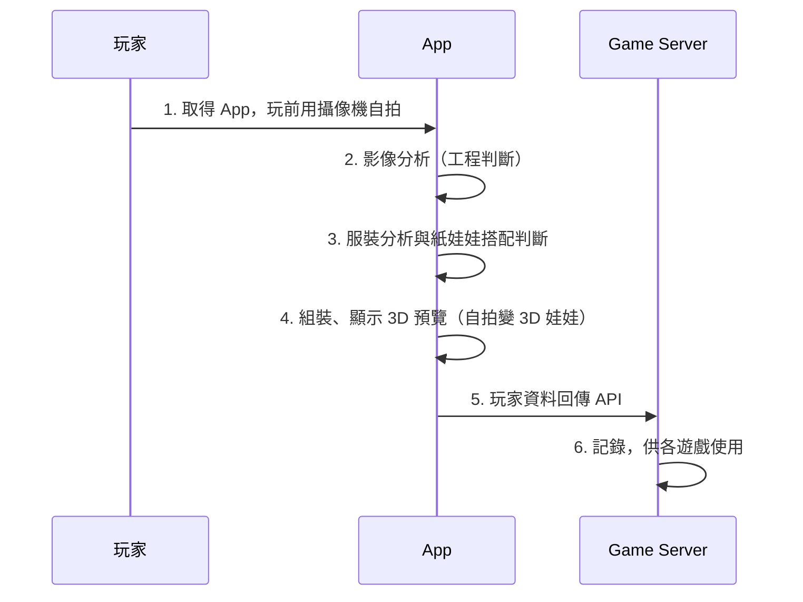
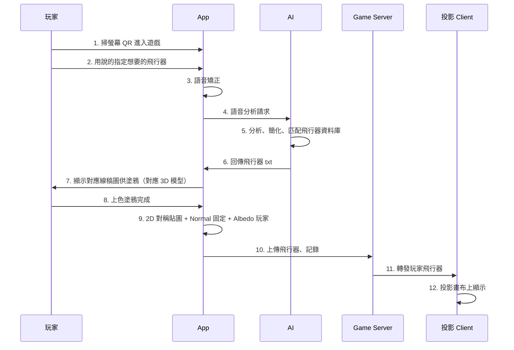
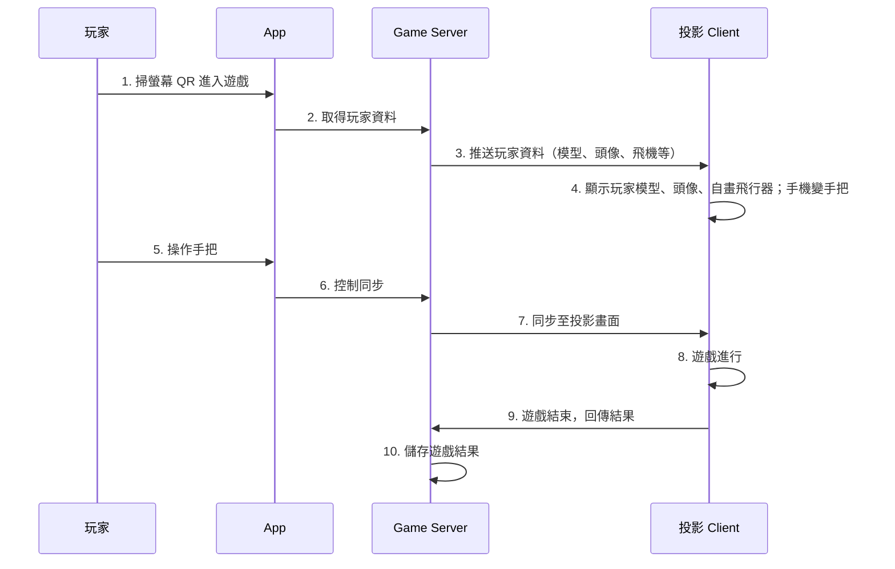
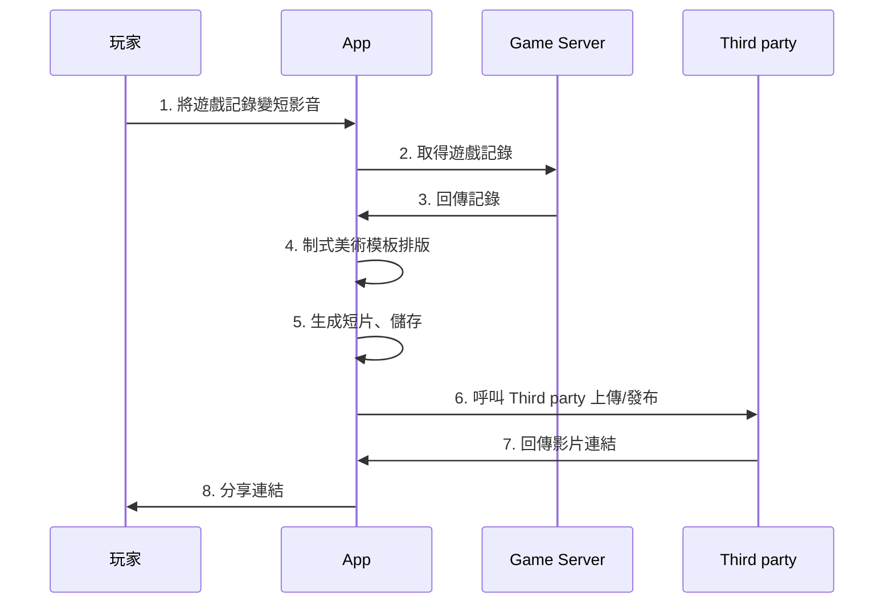

# 航空館功能報價及工程項目

---

## 一、功能與價格總表

**時程**：依照查核點所示，大概預計 3 個月總開發，約一個月一個大功能展示，第 4 個月總測試。

| 項目                                    | 功能包含                                                                                                                                                                                                                | 小計            |
| --------------------------------------- | ----------------------------------------------------------------------------------------------------------------------------------------------------------------------------------------------------------------------- | --------------- |
| 1. **Avatar 影像辨識與紙娃娃系統**      | 1. Unity App 建置、QRCode 等拍照功能整合 2. Unity 本地影像處理-服裝特徵（判斷髮型須額外 AI 訓練） 3. 紙娃娃系統（模型分件、組裝、材質套用） 4. 手機端、Server 儲存玩家資料                                     | 100,000 TWD     |
| 2. **塗鴉轉 3D 飛行器系統**             | 1. Unity App 建置 2. 語音輸入本地矯正，AI 分析辨識模組 3. 飛行器2D、3D模組資料庫匹配 4. 線稿塗鴉系統 5. 2D 貼圖轉 3D 模型整合 6. 手機端、投影端、Server 串接整合                                         | 10,0000 TWD     |
| 3. **多人連線與手機手把系統**           | 1. Unity Client 遊戲場景互動建置 2. Server 遊戲建置、單房湊桌 3. 同步三方設備：手機、投影、server、斷線連回 4. QRCode 攝影進入房間機制 5. 玩家資料讀取 server 與顯示                                       | 220,000 TWD     |
| 4. **短影音系統及其他整合功能**         | 1. 玩家資料庫建置 2. App 短片模板化排版 3. 短片呼叫 Third party 儲存並分享 4. 手機端、投影端多國語言 5. Unity WebView 串接 SDK 提供導覽                                                                     | 40,000 TWD      |
| 5. **所有遊戲美術、App 美編、音樂音效** | 1. 基礎玩家3D模型一個 2. 玩家服飾3D模型總共20種 3. 飛機2D線稿/3D白模為一組共6組（客機、戰鬥機、火箭、直升機、飛艇、螺旋槳飛機） 4. 5種3D場景主題（4個多人遊戲、1個塗鴉墻） 5. App 介面美編 6. 音樂與音效 | 60,000 TWD      |
| **總價**                                | —                                                                                                                                                                                                                       | **520,000 TWD** |

**進度勾選**（可點擊打勾，完成後將 `[ ]` 改為 `[x]` 也會被識別為已勾選）

- **1. Avatar 影像辨識與紙娃娃系統**
  - [ ] Unity App 建置、QRCode 等拍照功能整合
  - [ ] Unity 本地影像處理-服裝特徵（判斷髮型須額外 AI 訓練）
  - [ ] 紙娃娃系統（模型分件、組裝、材質套用）
  - [ ] 手機端、Server 儲存玩家資料
- **2. 塗鴉轉 3D 飛行器系統**
  - [ ] Unity App 建置
  - [ ] 語音輸入本地矯正，AI 分析辨識模組
  - [ ] 飛行器2D、3D模組資料庫匹配
  - [ ] 線稿塗鴉系統
  - [ ] 2D 貼圖轉 3D 模型整合
  - [ ] 手機端、投影端、Server 串接整合
- **3. 多人連線與手機手把系統**
  - [ ] Unity Client 遊戲場景互動建置
  - [ ] Server 遊戲建置、單房湊桌
  - [ ] 同步三方設備：手機、投影、server、斷線連回
  - [ ] QRCode 攝影進入房間機制
  - [ ] 玩家資料讀取 server 與顯示
- **4. 短影音系統及其他整合功能**
  - [ ] 玩家資料庫建置
  - [ ] App 短片模板化排版
  - [ ] 短片呼叫 Third party 儲存並分享
  - [ ] 手機端、投影端多國語言
  - [ ] Unity WebView 串接 SDK 提供導覽
- **5. 所有遊戲美術、App 美編、音樂音效**
  - [ ] 基礎玩家3D模型一個
  - [ ] 玩家服飾3D模型總共20種
  - [ ] 飛機2D線稿/3D白模為一組共6組（客機、戰鬥機、火箭、直升機、飛艇、螺旋槳飛機）
  - [ ] 5種3D場景主題（4個多人遊戲、1個塗鴉墻）
  - [ ] App 介面美編
  - [ ] 音樂與音效

**註：**

- 服裝特征與語音輸入的功能牽扯精准度，用 AI 辨識可以提高精准度，如果有可行的簡化做法：比如都直接由玩家自行輸入；或者 Unity 不做影像工程判斷、語音矯正處理，拍下來、錄下來帶著完整資料和 promote 交給 AI 自己跑（由負責AI的人優化速度），這樣的話項目 1、2 的價格可以再低。

**使用程式語言和技術**

1. 前端：Unity C#
2. 後端：Go、WebSocket 同步
3. 視情況使用 Python 搭建 AI 伺服器或訓練

---

## 二、企劃建議和落地方法

1. 玩家可以乘坐自己塗鴉的飛行器在多人遊戲裡面玩，玩家會增加流暢且完整的遊玩體驗，不加價。
2. 因為手機型號都不同，可能會讓分析精准度下降，由一台裝有攝像機的螢幕負責半身攝像、儲存，玩家手機負責掃描 qecode 登陸資訊，影像辨識的速度比較可控，玩家操作也會比較直觀方便，這裡會需要再做新的 Unity 場景但不加價。
3. Text-to-Image 換思路解法：從原本 AI 生模型改成 AI 取得語音文字後，分析並取得最接近目前已經做好的飛行器白模，並回傳 Client 調用該模型做塗鴉，這樣好做，查核點風險也降低。
4. 2D 貼圖轉 3D 模型的解法：讓模型都做左右對稱，2D塗鴉做特殊設計只需要畫一邊，另一邊做鏡像貼圖再裝到3D模組即可完美呈現3D模型。
5. 多人遊戲玩法流程我可以協助規劃。

---

## 三、玩家遊戲流程

### 3.1 影像辨識 → Avatar

### 3.2 塗鴉轉 3D 並投影在畫布

### 3.3 多人連線遊戲

### 3.4 短影音

