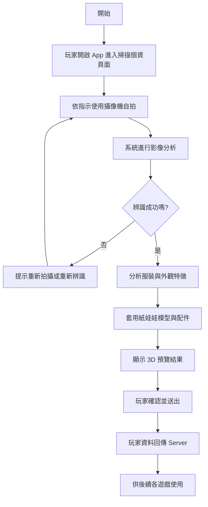
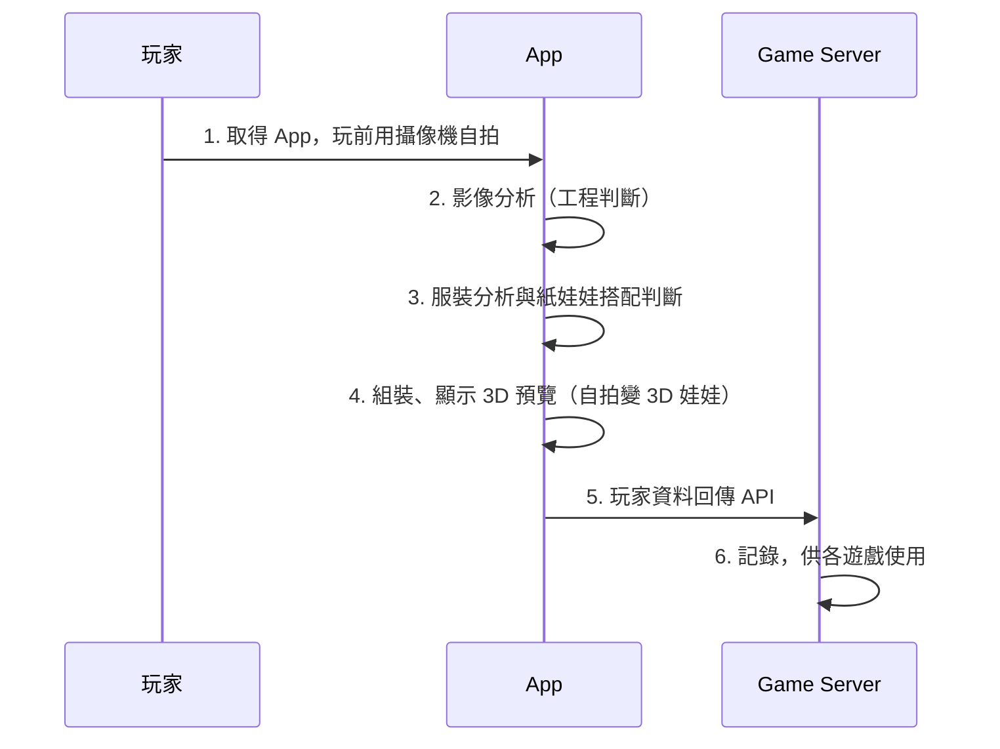
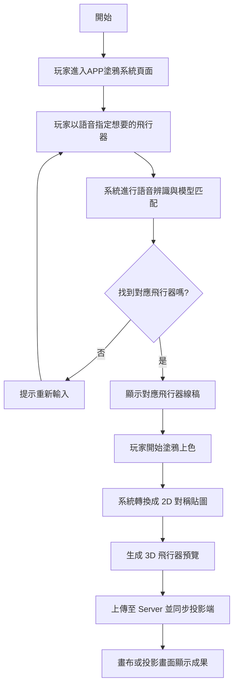
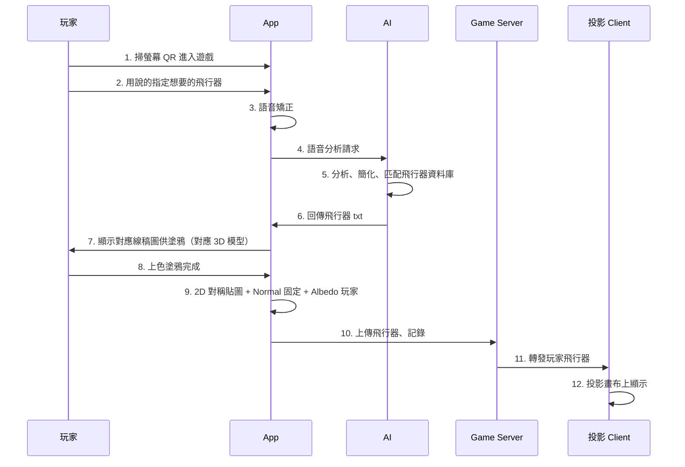
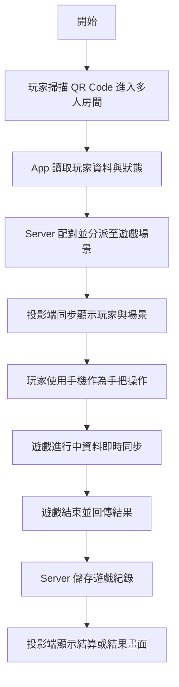
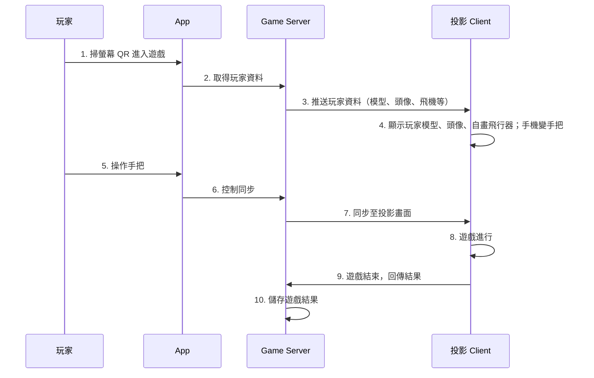
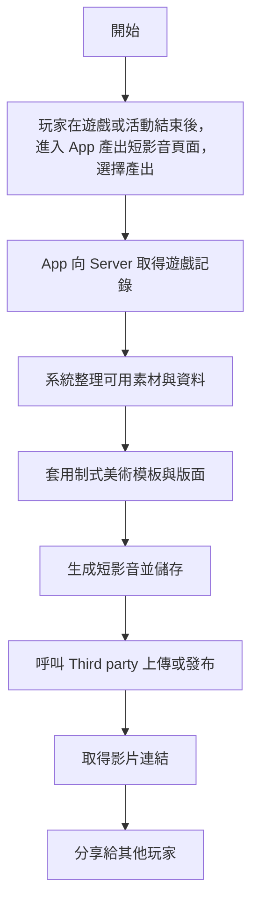
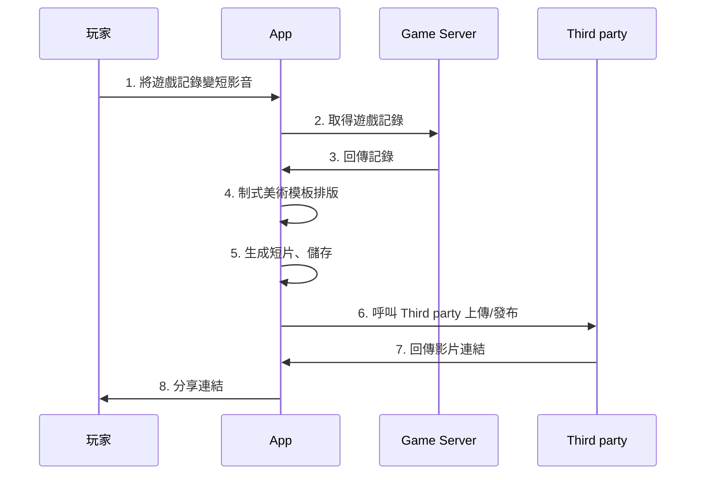

# 航空館功能細項及時程（含分項查核點）2026/3/18

- 以下是開發的細則，開發不含測試，並有預留測試時間。
- 工作天即非國定假日。
- 已將【拓凡有限公司WBS智慧航空案0316】所有的查核點都納入，因企劃、RD為同一人，規劃即開發，無法評估全部細則工作天數，固採用大項目總工作天，再請業主根據大項目提出查核時間點和項目。

---

## 一、Avatar 影像辨識與紙娃娃系統

**對應工程範圍**

- Unity App 建置、QRCode 拍照功能整合
- 本地影像處理與服裝特徵分析
- 紙娃娃系統（模型分件、組裝、材質套用）
- 手機端與 Server 玩家資料儲存

**規劃**

| 編碼   | 任務名稱                                    |
| ------ | ------------------------------------------- |
| C1-1-1 | 基礎影像擷取與人像辨識模組建置              |
| C1-1-2 | 基礎外觀特徵分類（如髮型、上衣 / 褲子顏色） |
| C1-1-3 | 特徵標註規範與基礎資料集建立                |

**開發**

| 編碼   | 任務名稱                                                   |
| ------ | ---------------------------------------------------------- |
| C1-2-1 | 辨識模型擴充，特徵分析眼睛大小、髮長、是否配戴眼鏡／帽子等 |
| C1-2-2 | 建立角色模組資料庫（模型元件庫）                           |
| C1-2-3 | 整合角色生成與玩家個人化 App （ID、角色、遊戲進度更新）    |
| C1-2-4 | App 顯示遊玩進度紀錄功能                                   |

### 使用者流程圖：Avatar 影像辨識與紙娃娃系統

### 系統時序圖概況：影像辨識 → Avatar

## 二、塗鴉轉 3D 飛行器系統

**對應工程範圍**

- Unity App 建置與語音輸入處理
- 飛行器 2D / 3D 模組資料庫匹配
- 線稿塗鴉系統與 2D 貼圖轉 3D 模型整合
- 與手機端、投影端、Server 的串接

**對應分項查核點**

**規劃**

| 編碼   | 任務名稱     |
| ------ | ------------ |
| C3-1-2 | 飛機樣式規劃 |

**開發**

（本段落其餘查核點工作歸屬非拓凡，已移除。）

### 使用者流程圖：塗鴉轉 3D 飛行器系統

### 系統時序圖概況：塗鴉轉 3D 並投影在畫布

## 三、多人連線與手機手把系統

**對應工程範圍**

- Unity Client 遊戲場景互動建置
- Server 遊戲建置與單房湊桌
- 手機、投影、Server 三方同步與斷線回連
- QRCode 攝影進入房間機制
- 玩家資料讀取與顯示

**對應分項查核點**

**規劃**

| 編碼   | 任務名稱                                              |
| ------ | ----------------------------------------------------- |
| C2-1-2 | GAI Skybox 規劃：主題清單至少 4 種、參數矩陣至少 2 個 |

**開發**

| 編碼   | 任務名稱                                                                          |
| ------ | --------------------------------------------------------------------------------- |
| C2-2-1 | C1 角色系統串接                                                                   |
| C2-2-2 | GAI Skybox 生成測試                                                               |
| C2-2-3 | 後台資料表設計與資料庫結構圖                                                      |
| C2-2-4 | 即時多人互動 App 之系統架構、介面設計及功能說明（任務提示、進度條、分數即時回饋） |
| C2-3-1 | 多人連線與網路情境測試（10 人以上同時連線）                                       |
| C2-3-2 | 行動裝置相容性測試                                                                |
| C2-3-3 | 飛行劇場遊戲紀錄整合至前端 App 與後台系統                                         |
| C2-3-4 | 飛行劇場軟體與硬體裝置部署                                                        |
| C2-4-1 | 飛行劇場軟體與硬體裝置現場測試                                                    |
| C2-4-2 | 軟體壓力測試及效能優化                                                            |

### 使用者流程圖：多人連線與手機手把系統

### 系統時序圖概況：多人連線遊戲

## 四、短影音系統及其他整合功能

**對應工程範圍**

- 玩家資料庫建置
- App 短片模板化排版
- 短片呼叫 Third party 儲存並分享
- 手機端、投影端多國語言
- Unity WebView 串接 SDK 提供導覽

**對應分項查核點**

**規劃**

（本段落規劃查核點工作歸屬非拓凡，已移除。）

**開發**

| 編碼   | 任務名稱                                      |
| ------ | --------------------------------------------- |
| C1-3-1 | 飛行劇場互動紀錄模組                          |
| C1-3-2 | 互動繪畫成果保存模組                          |
| C1-3-3 | 玩家個人化 App 可用性測試                     |
| C3-2-1 | 創作互動 App 開發，內容包含顯示作品縮圖與編號 |
| C3-2-3 | 創作互動系統後台開發                          |
| C3-3-5 | 手機互動介面優化：互動指引與提示優化          |

### 使用者流程圖：短影音系統及其他整合功能

### 系統時序圖概況：短影音

# 五、所有遊戲美術、App 美編、音樂音效

- 美術、音樂音效的製作天數已含在前四大段落的總工時。

**對應工程範圍**

- 基礎角色與服裝模型
- 飛機線稿與 3D 白模
- 3D 場景主題與場景元素
- App 介面美編與音樂音效

**對應分項查核點**

- `C3-1-4` 3D 城市場景設計
- `C3-3-2` 3D 城市場景開發：可即時顯示飛機、與場景的動態元素（建物、告示牌等）
- `C3-3-4` 創作互動體驗內容開發：場景動態元素設計
