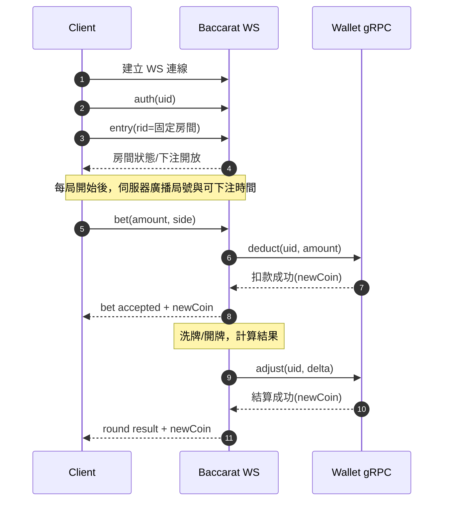
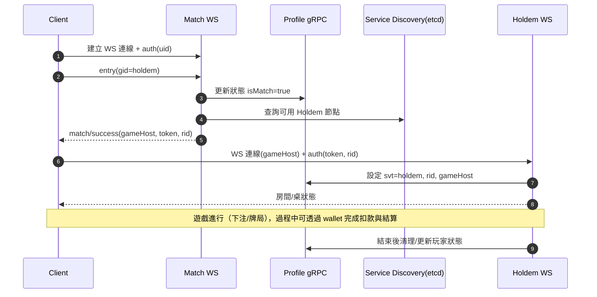

# Game Link 文件（單一入口）

本文件聚焦專案現況：已存在的服務、internal 結構與開發方式。Gate 相關規劃與時序圖移至 `TODO.md`。

## 專案分區與重點

- `clients/`：客戶端程式與素材。包含 `clients/ts/robot` 的 WebSocket 壓測/模擬 CLI，可用 YAML 定義多組機器人（simple/baccarat/holdem/auth）進行連線與指令測試。
- `services/`：後端微服務（baccarat、holdem、match、profile、wallet 等）。
- `internal/`：共用基礎設施（webcore、grpc、middleware、logger、datastore）。
- `proto/`：Protobuf 定義與產物。
- `tools/`：開發輔助腳本與生成工具。

## internal 結構概覽

- `webcore/ws`：WebSocket 伺服器、Context、路由註冊（`RegisterRequestHandler` / `RegisterNotifyHandler` / `RegisterFetchHandler` / `RegisterTriggerHandler`，簽名固定為 route, ctor, handler）。
- `grpc`：服務註冊與發現、連線池（`InitGRPC`、`PickConnection`）。
- `middleware`：WebSocket 的日誌、恢復、路由驗證、自動回應等中間件。
- `bootstrap`：載入設定與共用依賴（資料存取、logger 等）。
- `datastore` / `playerdata`：玩家資料抽象層，支援 Firestore 等存儲。
- `logger` / `etcd`：日誌與服務註冊/發現的共用工具。

## 建立 WebSocket 服務

1. 在 `services/<svt>/internal/handler` 撰寫 handler 並於 `init()` 註冊路由：

```go
func init() {
    ws.RegisterRequestHandler("auth", nil, AuthHandler)
    ws.RegisterNotifyHandler("entry", nil, EntryHandler) // notify 不回傳 Pack，ctor 填 nil
}

func AuthHandler(ctx ws.WSContext) {
    req := &pbbase.Auth{}
    ctx.ShouldBind(req)
    // ...業務邏輯...
    ctx.OK(req)
}
```

1. 在 `cmd/<svt>/main.go` 建立並啟動伺服器（可參考 `services/match/cmd/match/main.go`）：

```go
wsServer := ws.NewServer(port,
    wsmiddleware.LoggingMiddleware,
    wsmiddleware.RecoveryMiddleware,
    wsmiddleware.RouteHandlerMiddleware,
    wsmiddleware.AutoDefaultResponseMiddleware,
)
ws.ApplyRoutes(wsServer)
wsServer.Start()
```

1. 若需服務發現，啟動前呼叫 `etcd.MustInitFromEnv()`，並以 `grpc.InitGRPC(svt, sid, port, discoverServices)` 將節點註冊到 etcd。

## 建立 gRPC 服務

1. 初始化依賴：

```go
deps, _ := bootstrap.Init()
store := deps.Store
```

1. 服務註冊/發現（參考 `services/wallet/cmd/wallet/main.go`）：

```go
etcd.MustInitFromEnv()
grpc.InitGRPC(svt, sid, grpcPort, discoverServices)
```

1. 建立並啟動 gRPC 伺服器：

```go
s := grpcserver.NewServer()
walletpb.RegisterWalletServiceServer(s, wallet.NewWalletService(store))
lis, _ := net.Listen("tcp", ":"+grpcPort)
s.Serve(lis)
```

## 核心服務關係（wallet / match / profile）

- **wallet（gRPC）**：集中處理資產變化與查餘額，使用 datastore（Firestore）儲存。其他服務透過 gRPC（`grpcclient.WithClient` 或 `PickConnection`）直接呼叫 profile service 進行扣款/加值，可在經濟事件後推播 coin 更新。
- **profile（gRPC）**：玩家資料與狀態服務（暱稱、頭像、svt/rid/gameHost、isMatch 等）。match/gate/game 讀寫玩家所在服務、房間或封禁狀態，方便重連與路由。
- **match（WebSocket）**：湊桌與房間分配入口。依賴 profile 取得玩家狀態，成功配對後寫入 `svt/rid/gameHost` 供 client/gate 重連；遊戲扣款或結算則透過 wallet（或遊戲服務側直接調用）。
- **路由關係**：登入/路由流程由 gate service（規劃中）統一管理；match 與 game 透過 etcd 發現彼此，wallet/profile 提供經濟與狀態支撐。

## 百家樂（固定房間）流程



## 德州撲克（動態房間）流程


