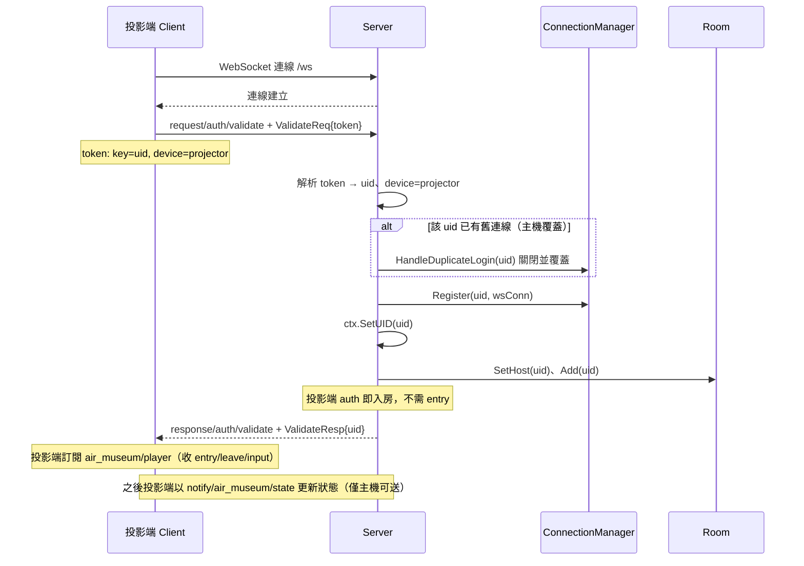
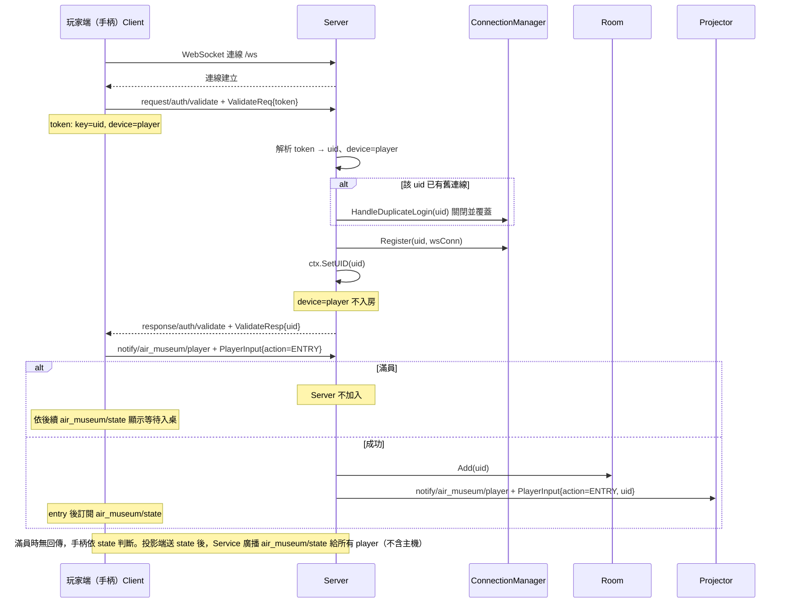
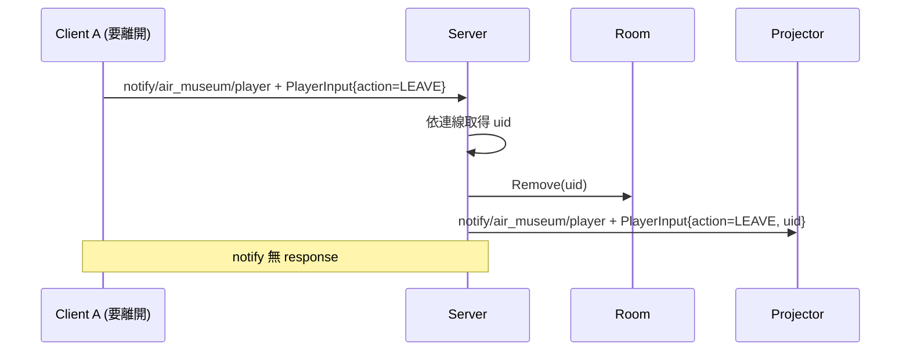
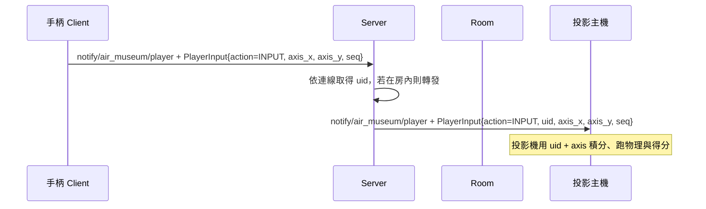
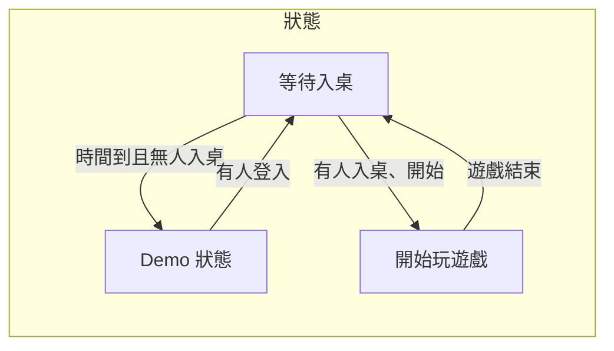

# air-museum 流程與時序

直連架構，協定沿用 `gate.Pack`（packType / svt / method / info）。WebSocket 連線單一 Server。

---

## API 一覽

**共同 API**：兩端皆須先認證。

| 路由 | packType | 方向 | 說明 |
|------|----------|------|------|
| auth/validate | request | Client → Server | 認證（共同），token 內含 key=uid、device=projector\|player |
| auth/validate | response | Server → Client | ValidateResp { uid, msg? } |

**玩家端唯一 API**：所有操作（入桌／離桌／輸入）皆經此送給 Server。

| 路由 | packType | 方向 | 說明 |
|------|----------|------|------|
| air_museum/player | notify | 玩家 → Server | PlayerInput { action, uid?, axis_x?, axis_y?, seq? }。action=ENTRY 入桌、LEAVE 離桌、INPUT 遊戲輸入；uid 由 Server 依連線填入。 |

**投影端唯一 API**：推送遊戲狀態，僅主機可送。

| 路由 | packType | 方向 | 說明 |
|------|----------|------|------|
| air_museum/state | notify | 投影端 → Server | GameState { state }；Server 填入 uids 後廣播 notify/air_museum/state 給所有玩家。 |

**Server 推給兩端的事件**（訂閱用，非 client 主動呼叫）：

| 路由 | packType | 方向 | 說明 |
|------|----------|------|------|
| air_museum/player | notify | Server → 投影端 | PlayerInput（房內玩家的 entry／leave／input），投影端依 action 處理。 |
| air_museum/state | notify | Server → 所有玩家 | GameState { state, uids }，手柄依 state 與 uids 顯示。 |
| air_museum/error | notify | Server → Client | 錯誤通知；須訂閱，收到後依 msg 處理（如提示重新 entry）。 |

**約定**：投影機先連 Service。**air_museum/player** 僅接受房內玩家的 action=INPUT；主機送 action=LEAVE 靜默忽略。人數上限 **maxPlayers** 由 config 設定。未認證送 air_museum/* 時回應「請先掃描螢幕 qrcode」。

**玩家資料（DB）**：Postgres 表 **player**（id、name、age、sex、avatar、score），由服務啟動時建立；顯示用資料由各端自行處理。

---

## 架構與約定

- **狀態來源**：手柄送 **air_museum/player**（action=ENTRY）入桌後，訂閱 **air_museum/state** 取得 state 與 uids。**投影端只送 air_museum/state**（GameState.state），Service 填入 uids 後廣播給所有玩家。
- **device**：token 解析得 uid、device（projector \| player）；projector 自動入房並設為主機，player 僅 Register、送 air_museum/player（action=ENTRY）入桌後監聽 air_museum/state。**重複 ENTRY 允許，視為已入桌**。
- **物理與得分**：在投影機本地；Server 不跑遊戲邏輯。**action=INPUT 僅接受房內玩家**，僅轉發給房內主機。

**Token**：`key=<uid>`、`device=projector|player`。**手柄輸入**：axis_x、axis_y（-1～1）、seq；約 15～20 Hz，投影機用固定速度積分。

---

## 1. 認證（Auth）與入桌流程

Client 連線後先送 **request/auth/validate**（ValidateReq 維持既有 gate 定義；token 由航空館 handler 解析 uid、device）。重複登入則關閉並覆蓋舊連線。**投影端** auth 後自動入房並設為主機，不需 entry；**玩家端** auth 後僅 Register，須送 **trigger/entry** 入桌，entry 成功後 client 立即顯示等待玩家入桌並監聽 **notify/gameStateEvent**。

### 1.1 投影端

device=projector：auth 通過後 Server 執行 SetHost(uid)、Add(uid)，投影端即入房，之後以 **notify/air_museum/state**（GameState）更新狀態即可，不需送 player。

#### 時序圖（投影端）

### 1.2 玩家端

device=player：auth 通過後 Server 僅 Register(uid)，不入房。手柄送 **notify/air_museum/player**（PlayerInput action=ENTRY）入桌；成功則 Add(uid)，client 訂閱 **air_museum/state** 取得狀態；滿員則 Server 不加入，手柄依 state 事件顯示等待入桌。

#### 時序圖（玩家端）

### 封包說明（Auth）

| 方向            | packType     | svt    | method   | info                                                                                      |
| --------------- | ------------ | ------ | -------- | ----------------------------------------------------------------------------------------- |
| Client → Server | 0 (request)  | auth   | validate | ValidateReq { token, gate_sid?, device? }（token 內含 key=uid, device=projector\|player） |
| Server → Client | 1 (response) | auth   | validate | ValidateResp { uid, msg? }                                                                |

---

## 2. 遊戲狀態（air_museum/state）

見 API 一覽。**僅主機**可送 **notify/air_museum/state**（GameState.state）；Service 填入 uids 後廣播 **notify/air_museum/state** 給**所有 player（不含主機）**；手柄訂閱 state 取得狀態。

### 封包說明

| 方向 | packType | svt | method | info |
|------|----------|-----|--------|------|
| 投影端 → Server | 2 (notify) | air_museum | state | GameState { state } |
| Server → 所有 player（由主機 state 觸發，不含主機） | 2 (notify) | air_museum | state | GameState { state, uids } |

---

## 3. 入桌（air_museum/player action=ENTRY）

手柄送 **notify/air_museum/player**（PlayerInput action=ENTRY）入桌。Server 成功則 Add(uid)，並轉發 **notify/air_museum/player**（action=ENTRY, uid）給投影端。滿員則不加入，**不特別回傳**，手柄依後續 **air_museum/state** 判斷。**重複 ENTRY 允許，視為已入桌**。projector 已在 auth 時入房，不需送 player。

### 封包說明

| 方向            | packType   | svt        | method | info     |
| --------------- | ---------- | ---------- | ------ | -------- |
| Client → Server | 2 (notify) | air_museum | player | PlayerInput { action=ENTRY } |
| 滿員時          | —          | —          | —      | 無回傳，手柄依 **air_museum/state** 判斷畫面 |

---

## 4. 離開房間（air_museum/player action=LEAVE）

**僅玩家可送**；**主機送 LEAVE 靜默忽略**。Client（手柄）送 **notify/air_museum/player**（PlayerInput action=LEAVE），Server 從房間移除該 uid 並轉發給投影端。

### 時序圖

### 封包說明

| 方向            | packType   | svt        | method | info                              |
| --------------- | ---------- | ---------- | ------ | --------------------------------- |
| Client → Server | 2 (notify) | air_museum | player | PlayerInput { action=LEAVE }     |

---

## 5. 手柄輸入（air_museum/player action=INPUT）

**僅房內玩家**的 input 會被接受。手柄送 **notify/air_museum/player**（PlayerInput action=INPUT, axis_x, axis_y, seq）；Server 檢查該 uid 是否在房內，若在則填入 uid 後僅轉發 **notify/air_museum/player** 給房內主機；非房內不轉發。

### 時序圖

### 封包說明

| 方向                           | packType   | svt        | method | info                                                                       |
| ------------------------------ | ---------- | ---------- | ------ | -------------------------------------------------------------------------- |
| 手柄 → Server                  | 2 (notify) | air_museum | player | PlayerInput { action=INPUT, axis_x, axis_y, seq }（uid 由 Server 填入）   |
| Server → 房內主機（projector） | 2 (notify) | air_museum | player | PlayerInput { action=INPUT, uid, axis_x, axis_y, seq }                    |

### PlayerInput 欄位

| 欄位   | 型別   | 說明                                         |
| ------ | ------ | -------------------------------------------- |
| uid    | uint32 | 玩家 ID；手柄送包時可不填，Server 轉發時填入 |
| axis_x | float  | 左右，建議範圍 -1～1                         |
| axis_y | float  | 上下，建議範圍 -1～1                         |
| seq    | uint32 | 序號（保留）                                 |

---

## 斷線與連線清理

- **主機重複登入**：關閉並覆蓋舊連線（HandleDuplicateLogin）。
- **主機（投影端）斷線後重連**：投影端會自動重連；再次連線後，Server **只踢房內玩家**：對每位房內玩家先送 **air_museum/error**（msg 提示須重新 entry），再關閉連線；玩家須點擊登入重新 entry。
- **player 斷線**：若在房內 → Remove(uid)；若不在房內 → 僅關閉連線。
- **主機送 player action=LEAVE**：靜默忽略。**非主機送 state**：靜默丟棄（不廣播）。

---

## 投影機視角流程圖

---

## 未認證與 auth 錯誤

送 air_museum/* 未先 **auth/validate** 時 Server 回應錯誤：**請先掃描螢幕 qrcode**。**auth 錯誤**（如 token 格式錯誤、解析失敗）直接回傳錯誤，手柄／手機顯示再連線一次的視窗。

---

## 待辦（TODO）

- **建立個人檔案**：由另一 API 實作，供玩家建立／更新 avatar、plane 等資料並寫入 Postgres。

